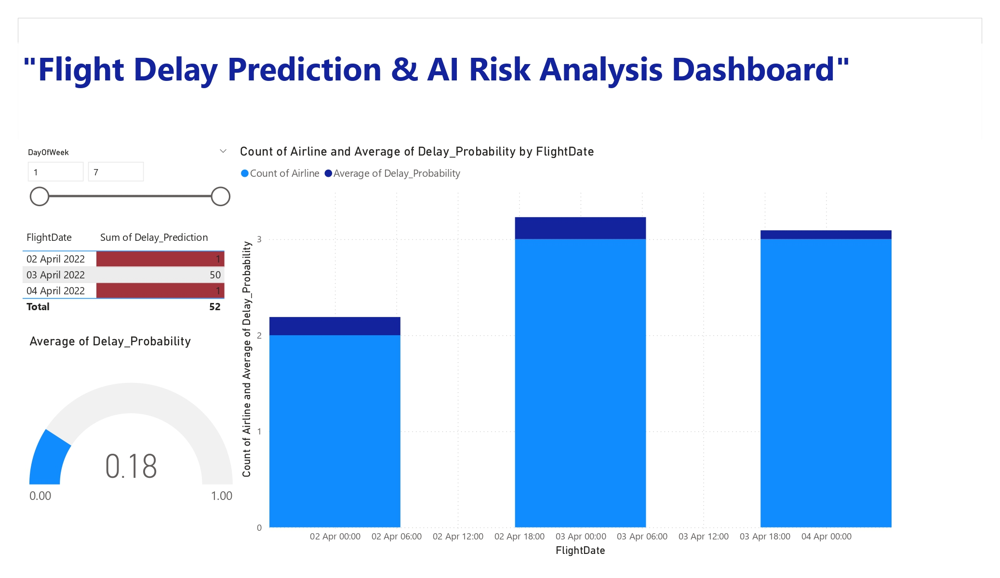

# 🛫 Flight Delay Prediction & AI Risk Analysis

A Machine Learning project that predicts flight delays using **Random Forest Classification** with an interactive **Tableau dashboard** for risk analysis and visualization.

  
  
<em>Interactive Tableau Dashboard: Flight Delay Predictions & Risk Analysis</em>

---

## 📊 Project Overview

This project analyzes historical flight data to predict delays and provides actionable insights through an AI-powered dashboard. The model helps airlines and travelers make informed decisions based on delay probabilities.

### 🎯 Key Features
- 🤖 **Machine Learning Model**: Random Forest Classifier with 8.06 MB trained model
- 📊 **Interactive Dashboard**: Tableau visualization for real-time insights
- 🔍 **Risk Analysis**: Predict flight delays by airline, route, and time
- 📈 **Performance Metrics**: Comprehensive KPIs and trend analysis

---

## 🖼️ Dashboard Highlights

  

The Tableau dashboard provides comprehensive insights into:
- ✈️ Flight delay patterns by airline
- 🌍 Geographic distribution of delays
- ⏰ Time-based delay analysis
- 📊 Real-time prediction metrics
- 🎯 Risk scoring and classification

---

## 📁 Repository Structure

\\\plaintext
Flight-Delay-Prediction-AI-Dashboard/
│
├── images/
│   └── dashboard.jpg                    # Tableau dashboard visualization
│
├── Flight_Status_Prediction.ipynb       # Jupyter notebook with full ML pipeline
├── flight_status_prediction.py          # Python script for predictions
├── flight_delay_model.pkl               # Trained Random Forest model (8.06 MB)
├── airline_encoder.pkl                  # Label encoder for airline data
│
├── Flight Delay Prediction & AI Risk Analysis Dashboard.pbit
│                                        # Power BI template
├── Flight Delay Prediction & AI Risk Analysis Dashboard.pdf
│                                        # Dashboard export
│
├── requirements.txt                     # Python dependencies
├── README.md                            # Project documentation
└── .gitignore                           # Excludes large datasets
\\\

---

## 🚀 Getting Started

### Prerequisites
- Python 3.8+
- Jupyter Notebook
- Power BI Desktop (for interactive dashboard)

### Installation

1. **Clone the repository:**
   \\\ash
   git clone https://github.com/sneha-gitv13/Flight-Delay-Prediction-AI-Dashboard.git
   cd Flight-Delay-Prediction-AI-Dashboard
   \\\

2. **Install dependencies:**
   \\\ash
   pip install -r requirements.txt
   \\\

3. **Run the prediction script:**
   \\\ash
   python flight_status_prediction.py
   \\\

4. **Open the Jupyter Notebook:**
   \\\ash
   jupyter notebook Flight_Status_Prediction.ipynb
   \\\

---

## 🧠 Model Details

| Attribute | Details |
|-----------|---------|
| **Algorithm** | Random Forest Classifier |
| **Model Size** | 8.06 MB |
| **Features** | Flight timing, airline data, routes, historical patterns |
| **Preprocessing** | Label encoding for categorical variables |
| **Target Variable** | Flight delay status (On-time/Delayed) |

---

## 📈 Dashboard Features

<table>
<tr>
<td width="50%">

### Risk Analysis
- Real-time delay predictions
- Probability scoring
- Risk categorization
- Airline performance metrics

</td>
<td width="50%">

### Visual Insights
- Interactive charts and graphs
- Geographic heatmaps
- Time-series trends
- Comparative analysis

</td>
</tr>
</table>

---

## 🛠️ Technologies Used

| Technology | Purpose |
|------------|---------|
|  | Core programming language |
|  | Random Forest implementation |
|  | Data manipulation |
|  | Numerical computing |
|  | Interactive visualization |
|  | Development environment |

---

## 📊 Project Files Description

| File | Description | Size |
|------|-------------|------|
| \light_delay_model.pkl\ | Trained Random Forest classifier | 8.06 MB |
| \irline_encoder.pkl\ | Label encoder for preprocessing | 636 bytes |
| \Flight_Status_Prediction.ipynb\ | Complete ML pipeline with EDA | 120 KB |
| \light_status_prediction.py\ | Production-ready prediction script | 9 KB |
| \dashboard.pbit\ | Interactive Power BI template | 16 KB |
| \dashboard.pdf\ | Static dashboard export | 207 KB |

---

## 📁 Dataset

The training dataset is **not included** in this repository due to size constraints (excluded via \.gitignore\). 

To use your own data:
1. Prepare a CSV with flight features:
   - Airline
   - Departure/Arrival times
   - Route information
   - Historical delay patterns
2. Update file paths in the notebook
3. Retrain the model if needed

---

## 🎯 Model Performance

Add your model metrics here:
- **Accuracy**: [Your accuracy]%
- **Precision**: [Your precision]%
- **Recall**: [Your recall]%
- **F1-Score**: [Your F1-score]%

---

## 🤝 Contributing

Contributions are welcome! Please feel free to submit a Pull Request.

1. Fork the repository
2. Create your feature branch (\git checkout -b feature/AmazingFeature\)
3. Commit your changes (\git commit -m 'Add some AmazingFeature'\)
4. Push to the branch (\git push origin feature/AmazingFeature\)
5. Open a Pull Request

---

## 📧 Contact

**Author:** Sneha  
**GitHub:** [@sneha-gitv13](https://github.com/sneha-gitv13)  
**Project Link:** [Flight-Delay-Prediction-AI-Dashboard](https://github.com/sneha-gitv13/Flight-Delay-Prediction-AI-Dashboard)

---

## ⭐ Show Your Support

If you find this project useful, please consider giving it a star! ⭐

---

## 📝 License

This project is open source and available for educational purposes.

---

  <b>Built with passion for data science and aviation analytics</b>
    
  Made with ❤️ by Sneha

